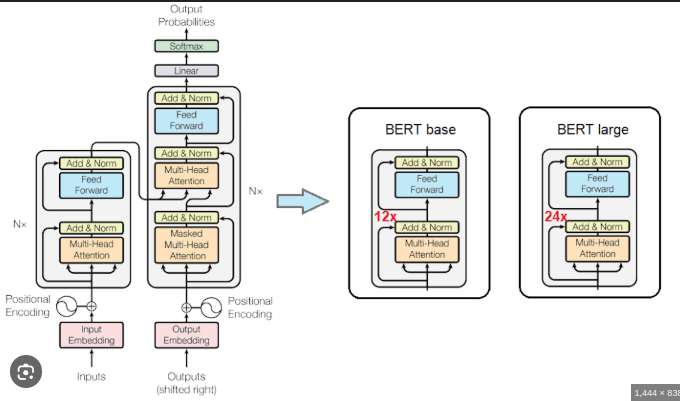
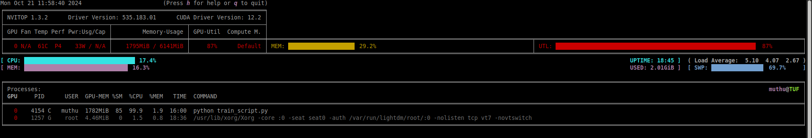
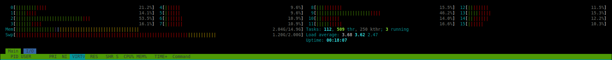
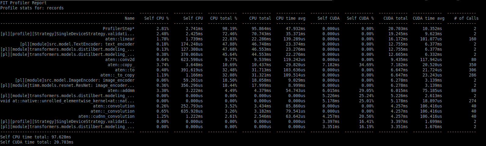
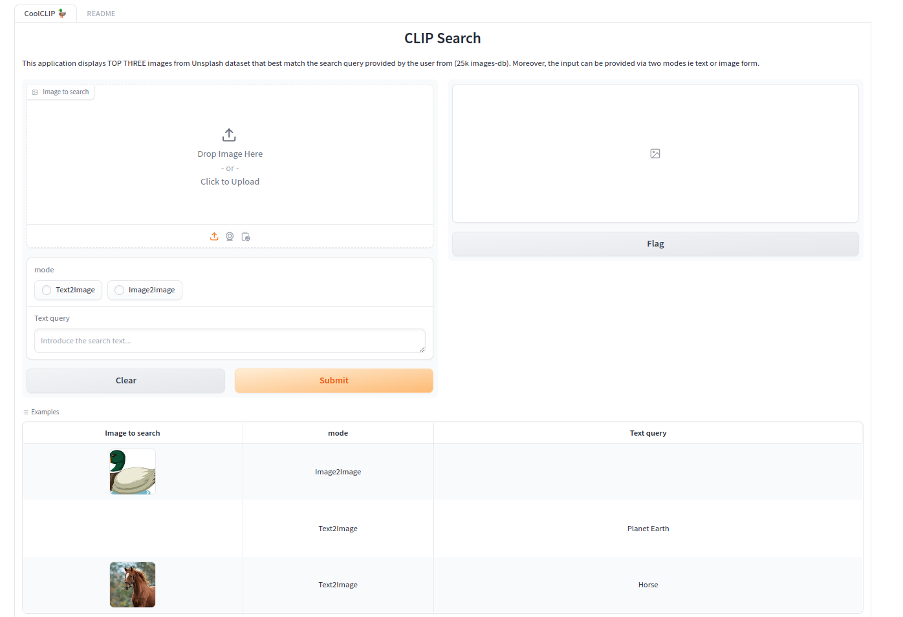

# CLIP

In early days of transformers starts dominating (ViTs) comes **Contrastive Language–Image Pre-training** ([CLIP](https://github.com/openai/CLIP)-2021) is a powerful neural network model that learns to associate textual descriptions with images.


# Dataset
The experiment are performed on [kaggle dataset](https://www.kaggle.com/datasets/adityajn105/flickr8k)


## APPROACH


*Image Encoder* may or maynot comes with CNN backbone process image 
- resnet
- densenet

*Text Encoder*  
- bert 
- distilbert


##  Text Encoder
captions were tokenized by `DistilBert`

```python
tokenizer = DistilBertTokenizer.from_pretrained("distilbert-base-uncased")
tokenizer( list(captions), padding=True, truncation=True, max_length=200 )
text_model = .model = DistilBertModel.from_pretrained("distilbert-base-uncased")
```

<!-- <div align='center'></div> -->
<div align='center'></div>


## Image Encoder
transforms help to standardise the image and pass to the model

```python
def get_transforms(mode="train"):
    if mode == "train":
        return A.Compose(
            [   
                A.Resize(224, 224, always_apply=True),
                A.Normalize(max_pixel_value=255.0, always_apply=True),
            ]
        )
    else:
        return A.Compose(
            [
                A.Resize(224, 224, always_apply=True),
                A.Normalize(max_pixel_value=255.0, always_apply=True),
            ]
        )
```
pretrained `resnet` model
```python
image_model = timm.create_model( 'resnet18', pretrained, num_classes=0, global_pool="avg" )
```
<div align='center'></div>


## Projection Head

Sometimes, `output_image_embedding` won't be same dimension as `output_text_embedding` to make it same dimension it act as adapters.
It follow simple residual block with non-linear activations

```python
class ProjectionHead(nn.Module):
    def __init__(
        self,
        embedding_dim,
        projection_dim=256,
        dropout=CFG.dropout
    ):
        super().__init__()
        self.projection = nn.Linear(embedding_dim, projection_dim)
        self.gelu = nn.GELU()
        self.fc = nn.Linear(projection_dim, projection_dim)
        self.dropout = nn.Dropout(dropout)
        self.layer_norm = nn.LayerNorm(projection_dim)
    
    def forward(self, x):
        projected = self.projection(x)
        x = self.gelu(projected)
        x = self.fc(x)
        x = self.dropout(x)
        x = x + projected
        x = self.layer_norm(x)
        return x
```


## CLIP Model
Combines Image and Text model by adapters and make it understandable.

```python
class CLIPModel(pl.LightningModule):
    def __init__(image_embedding,text_embedding) -> None:
        super().__init__()
        self.image_encoder = ImageEncoder()
        self.text_encoder = TextEncoder()
        self.image_projection = ProjectionHead(embedding_dim=image_embedding)
        self.text_projection = ProjectionHead(embedding_dim=text_embedding)

    def forward(batch):
        image_features = self.image_encoder(batch["image"])
        text_features = self.text_encoder( input_ids=batch["input_ids"], attention_mask=batch["attention_mask"]  )
        image_embeddings = self.image_projection(image_features)
        text_embeddings = self.text_projection(text_features)

        # Calculating the Loss
        logits = (text_embeddings @ image_embeddings.T) / self.temperature
        images_similarity = image_embeddings @ image_embeddings.T
        texts_similarity = text_embeddings @ text_embeddings.T
        targets = F.softmax(  (images_similarity + texts_similarity) / 2 * self.temperature, dim=-1 )
        texts_loss = cross_entropy(logits, targets, reduction='none')
        images_loss = cross_entropy(logits.T, targets.T, reduction='none')
        loss =  (images_loss + texts_loss) / 2.0 # shape: (batch_size)
        return loss.mean()
```

## Model Summary
```log
  | Name             | Type           | Params | Mode 
------------------------------------------------------------
0 | image_encoder    | ImageEncoder   | 11.2 M | train
1 | text_encoder     | TextEncoder    | 66.4 M | train
2 | image_projection | ProjectionHead | 197 K  | train
3 | text_projection  | ProjectionHead | 263 K  | train
------------------------------------------------------------
78.0 M    Trainable params
0         Non-trainable params
78.0 M    Total params
312.001   Total estimated model params size (MB)
200       Modules in train mode
0         Modules in eval mode
```

## Training
- nvitop
<!--  -->
<div align='center'></div>

- htop
<!--  -->
<div align='center'></div>

- training
<!--  -->
<div align='center'></div>


# Inference
## GRADIO APP
<div align='center'></div>
<!-- <div></img></div> -->