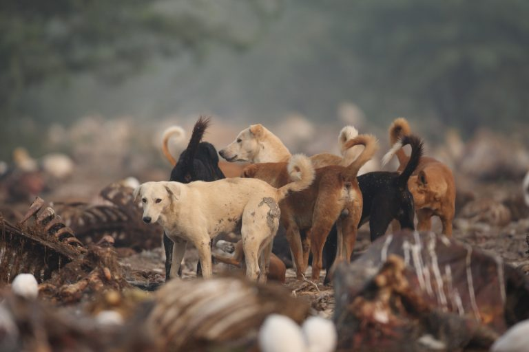
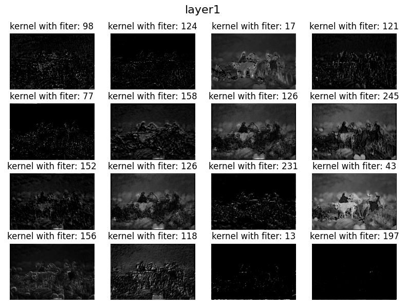
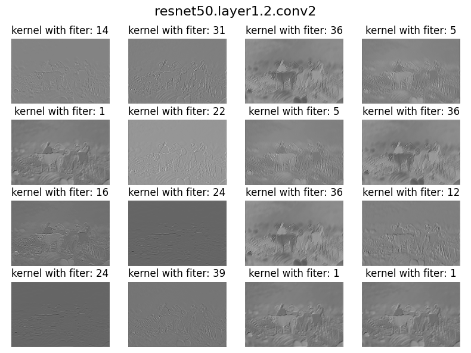
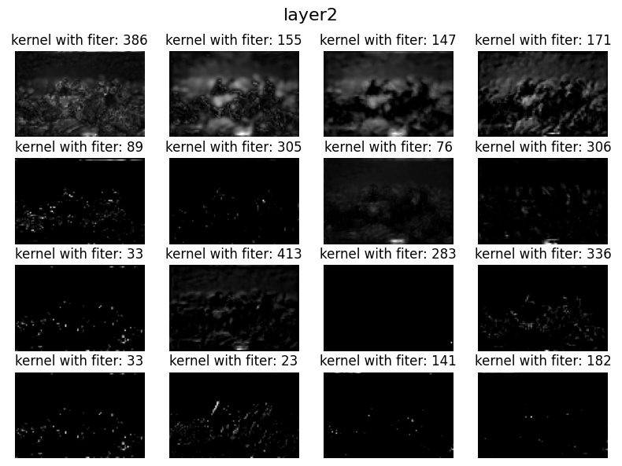
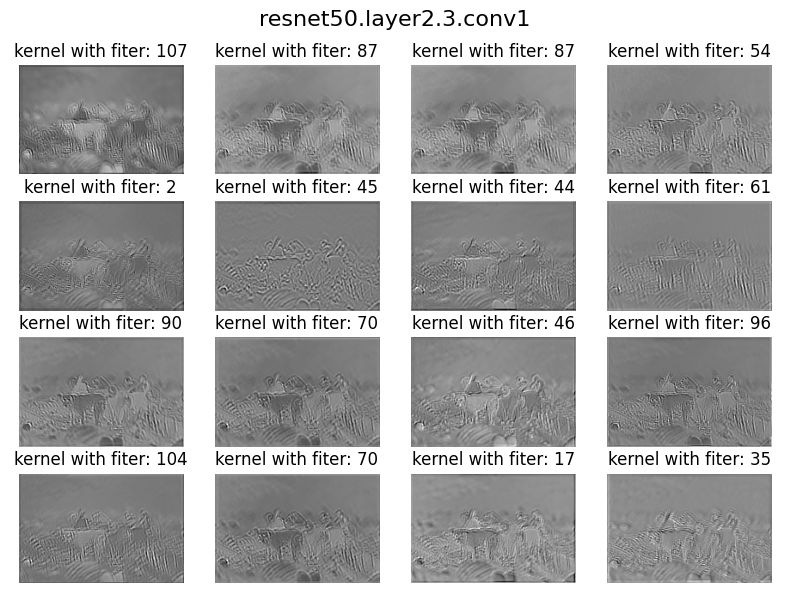
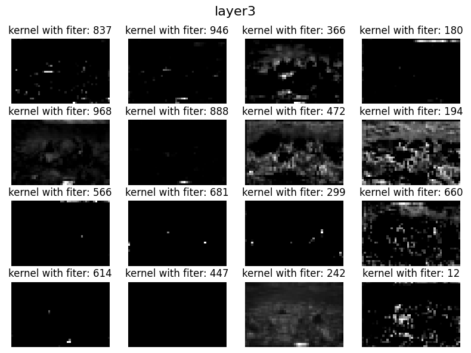
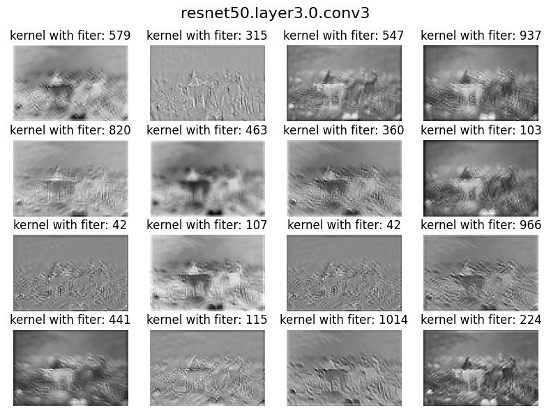
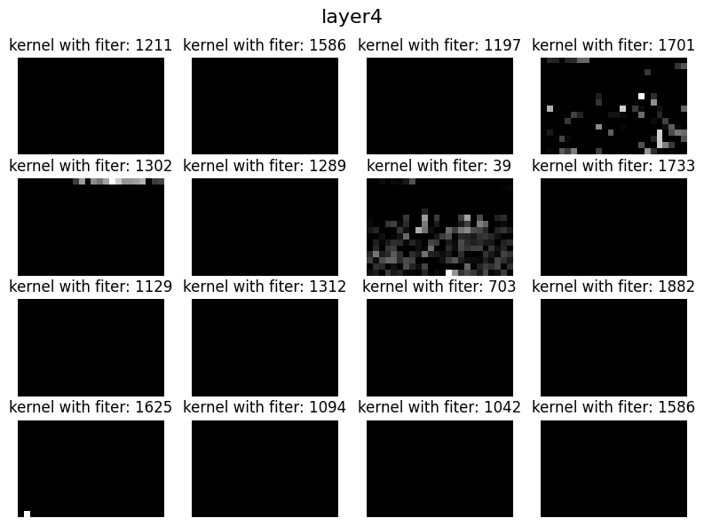
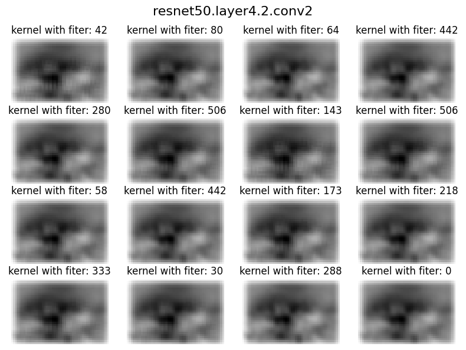

# Taming CNN Kernels

## 
Original Image 🐕

- [X] Image with Occlusion 
- [X] Different shapes in same image
- [X] Multiple Objects in same image

## 
ResNet Block 👉🏽👈🏽

## 
Layer 1️⃣

## 
Layer 2️⃣

## 
Layer 3️⃣

## 
Layer 4️⃣

