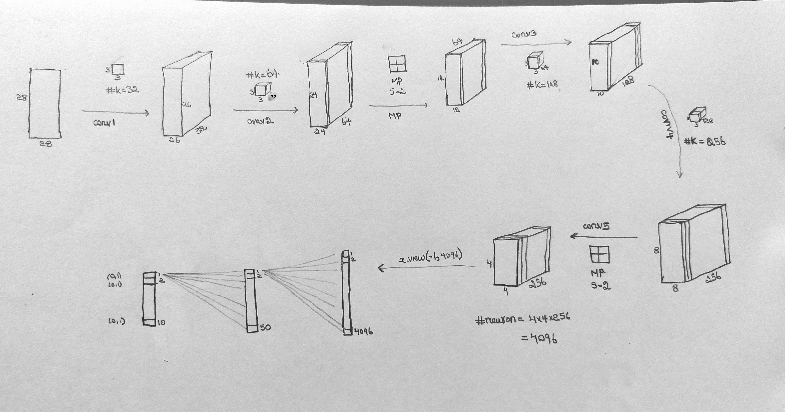
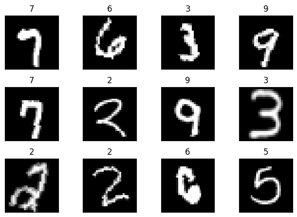
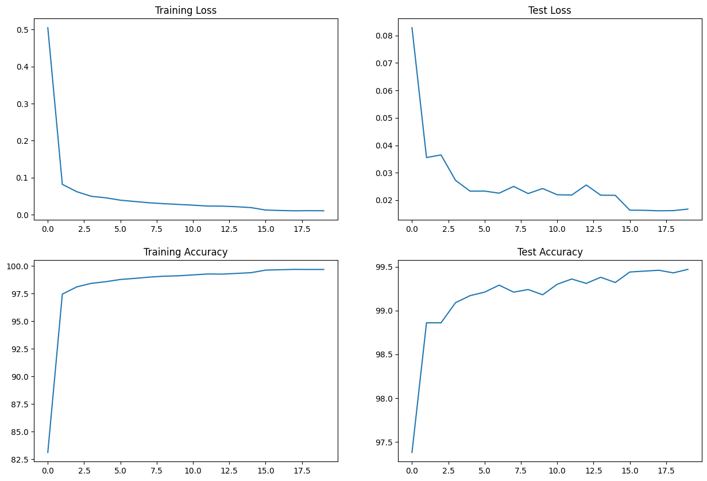

# Structure
```sh
CH5
|_ README.md
|_ S5.ipynb
|_ init.py
|_ model.py
|_ config.toml
```

# config.toml
File to keep all config arguments.
```md
- batch_size
- shuffle
- num_workers
- pin_memory
- lr
- momentum
- step_size
- gamma
- num_epochs
```

# model.py
Simple CNN implementation using pytorch

## CNN MODEL


## Model Summary


# utils.py
keep all helper function for training, test boilerplate code and image transformation code 
- center crop
- resize (28*28) pixel
- random rotation
- normalization

## Dataset


# Results
