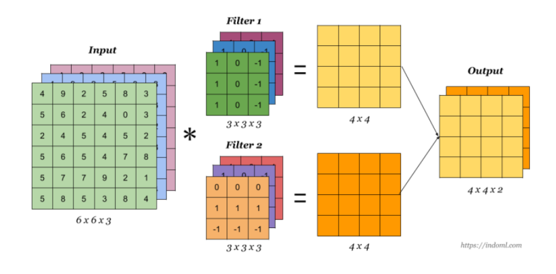
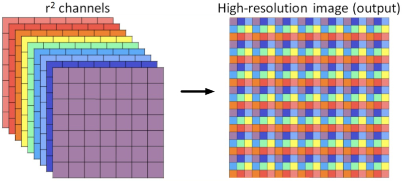
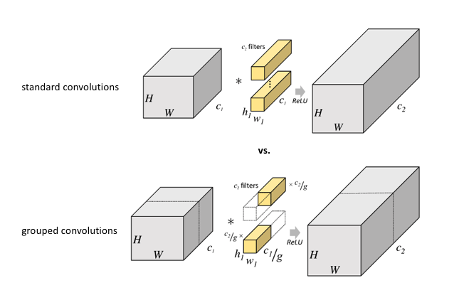
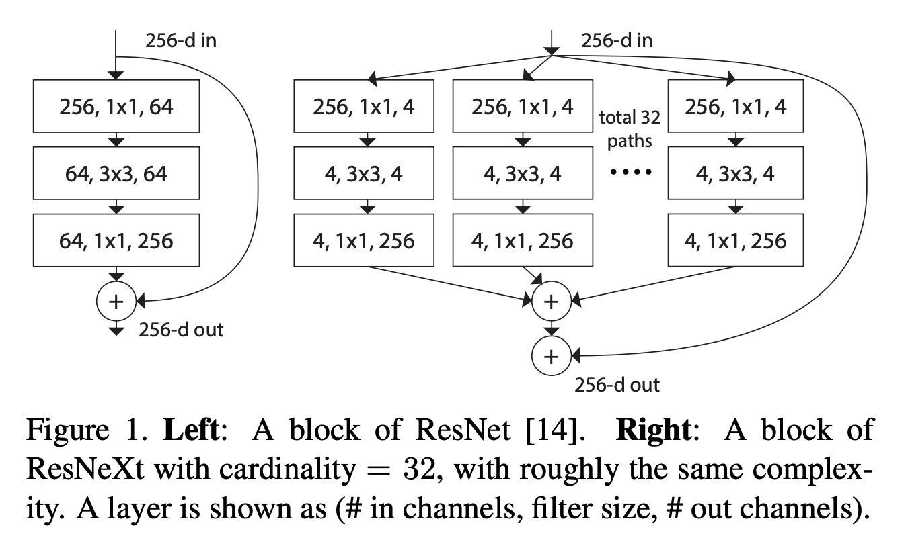
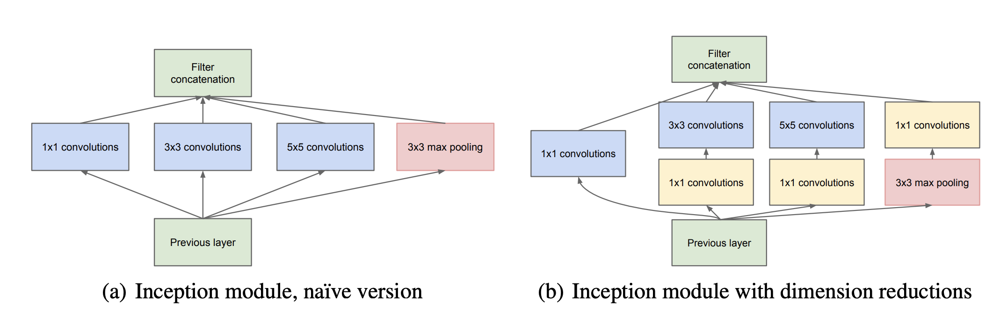
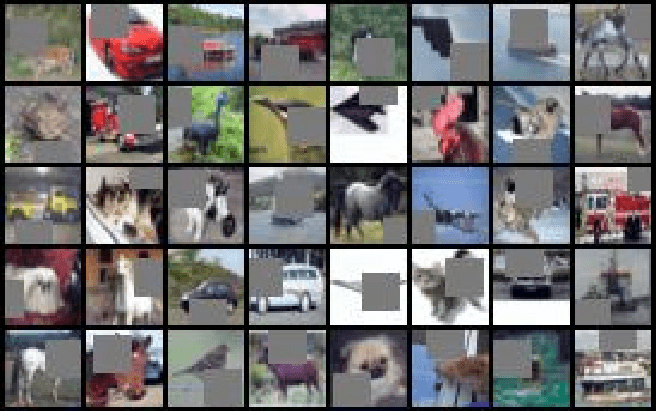
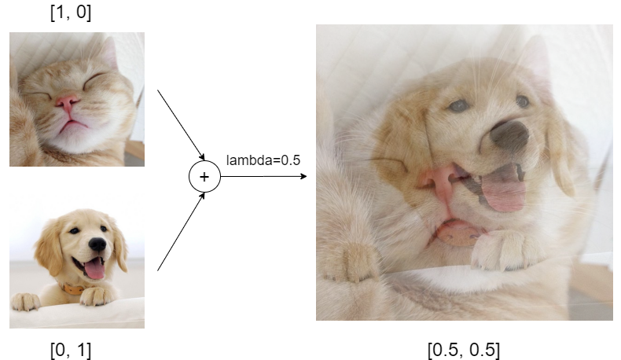

# ADVANCED CONVOLUTIONS

## Normal Convolution
<!--  -->

## MultiChannel Convolution
<!--  -->

## [Receptive Fields](https://distill.pub/2019/computing-receptive-fields/)
- benefits of going beyond RF of image  (Edges/Gradient >> Pattern >> Parts of Image >> Image >> ??)

## [Stride & Checkerboard Issues](https://distill.pub/2016/deconv-checkerboard/)

Q: `How do we get 5x5 RF with one 3x3 Kernels?`
## [Atrous or Dilated Convolution](https://ezyang.github.io/convolution-visualizer/)
- increase the receptive view (global view) of the network exponentially and linear parameter accretion. 
- usage: **dense predicition**
    - Semantic Segmentation
    - Instance Segmentation
    - Panoptic Segmentation
    - Image Super-Resolution
    - Generative Art with Reference Image
    - Facial recognition
    - Post-Estimation

<!--  -->

Q: `How do we increase channels size after convolution`
## Transpose Convolution or Deconvolution (Bilinear Interpolation)
<!--  -->

`Key:` 
- Dilated Conv is NOT to make features. 
- It's for Detect/Integration of features.

## Pixel Shuffle
<!--  -->

## Depthwise Seperable Convolution
<!--  -->

## Grouped Convolutions

# ARCHITECTURE
## RESNET & RESNEXT 

## INCEPTION 

# DATA AUGMENTATION
[The performance on vision tasks increases logarithmically based on the volume of training data size with preserving labels]()

- PMDA ( Poor Man's Data Augmentation Strategies)
    - Scale
    - Translation; 
    - Rotation; 
    - Blurring; 
    - Image Mirroring; 
    - Color Shifting / Whitening.
- MMDA ( Middle-Class Man's )
    - CutOut

    

    - Mixup
    
    

    - Elastic Distortions
    - RICAP
    
    

- RMDA ( Rich Man's ) 
    - Reinforcement Learning or AutoAugmentations

# Dense VS Sparse Problems

- [X] Invariance   e.g) classification
- [X] Equivariance e.g) segmentation
 
